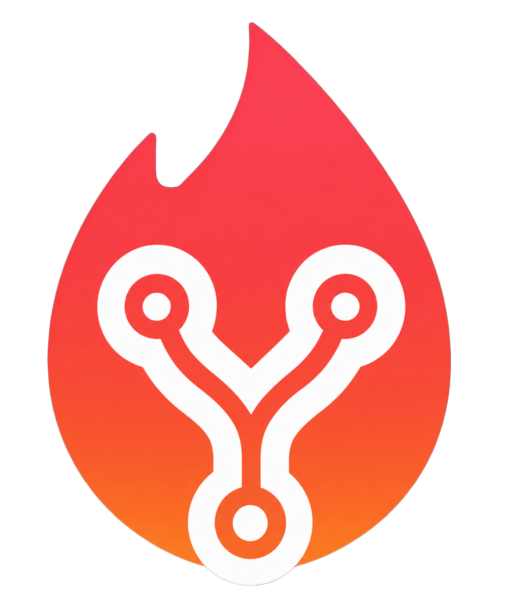
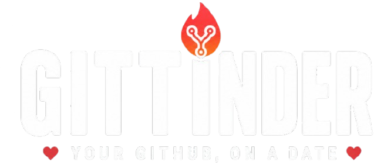
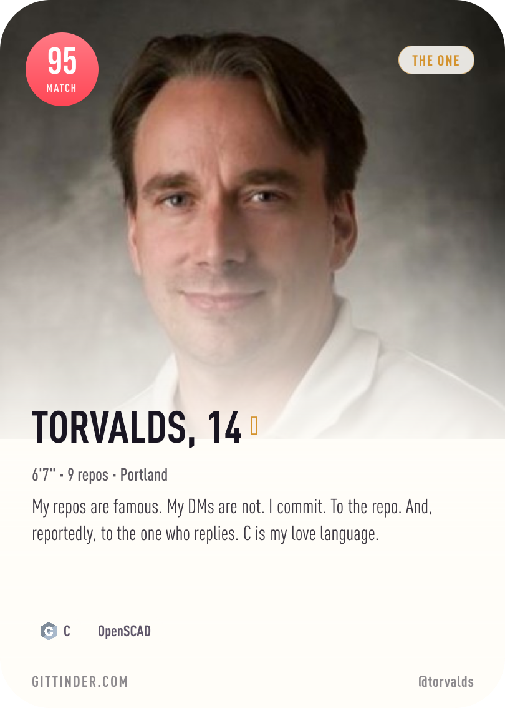
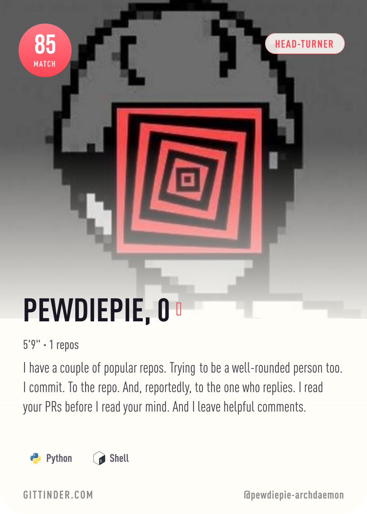
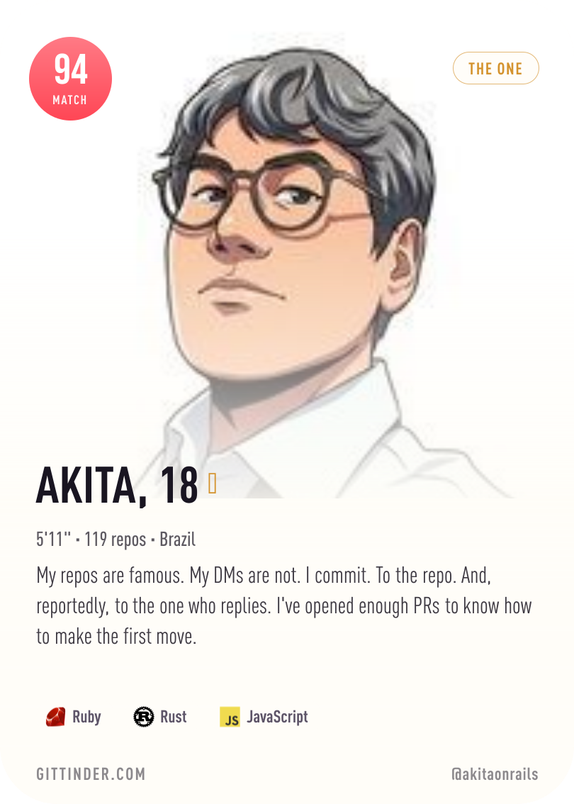
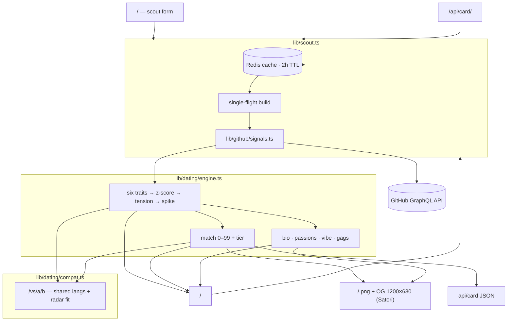

<div align="center">

<p align="center">
  
</p>

<p align="center">
  
</p>

<sub>GitHub × Tinder — a dating profile for any GitHub account, rated 0–99.</sub>

<p align="center">
  
  
  
  
  
  
  
</p>

<p align="center">
  <a href="#preview">Preview</a> ·
  <a href="#features">Features</a> ·
  <a href="#quick-start">Quick Start</a> ·
  <a href="#urls">URLs</a> ·
  <a href="#architecture">Architecture</a> ·
  <a href="#scoring">Scoring</a> ·
  <a href="#the-card">The Card</a> ·
  <a href="#deploy">Deploy</a> ·
  <a href="#tech-stack">Tech Stack</a> ·
  <a href="#project-structure">Structure</a> ·
  <a href="#license">License</a>
</p>

</div>

---

GitTinder turns any GitHub account into a **Tinder-style dating profile**, read straight from real GitHub stats — no self-reporting, no surveys. A match score, a tier, a generated bio, passion tags, a vibe and the six traits that explain it all. You can also test the **chemistry between two accounts** (`/vs/a/b`) and share your profile as a live card image (`/<user>.png`) that re-matches itself as your stats change.

Everything runs on the GitHub GraphQL API (`contributionsCollection` — the only endpoint that returns real per-year commit / PR / review / issue / calendar data), so the "personality" is anchored to actual numbers, never invented.

## Preview

<div align="center">

<a href="https://git-tinder-mu.vercel.app/torvalds"></a>
<a href="https://git-tinder-mu.vercel.app/pewdiepie-archdaemon"></a>
<a href="https://git-tinder-mu.vercel.app/akitaonrails"></a>

<br/>

<sub>Live cards, generated server-side from real GitHub data.</sub>

</div>

## Features

| Feature | Description |
|---|---|
| **Match score** | A 0–99 rating — a weighted blend of six dating traits |
| **Six traits** | SPARK, CHAT, STYLE, LOYAL, CARE, ENERGY — each scouted from real numbers |
| **Tiers** | RED FLAG → GREEN FLAG → KEEPER → A CATCH → HEAD-TURNER → THE ONE |
| **Generated bio** | Lines like *"My repos are famous. My DMs are not."* — every one anchored to a real figure |
| **Passion tags** | *Open source*, *Star magnet*, *Polyglot*… each with the real number that earned it |
| **Vibe** | An archetype read off your trait shape — The Influencer, The Social Butterfly, The Polyglot… |
| **The gags** | "Age" is your years on GitHub, "height" is your star count, online/away/offline reads your contribution calendar |
| **Pair chemistry** | `/vs/a/b` — shared languages + radar complementarity + match scores into one 0–99 chemistry score with its own tiers (MATCH MADE IN MERGE → SWIPE LEFT) |
| **Live card image** | `/<user>.png` — a shareable card that regenerates as your stats change |
| **OG unfurls** | Every profile and every pair unfurls with its exact rating on Twitter / Slack / Discord |
| **Raw JSON API** | `/api/card/<user>` returns the full scored profile |
| **Live scout counter** | The home page shows an all-time "profiles matched" tally (Redis) |
| **Tokenless demo** | With no token configured, the baked sample profiles (`torvalds`, `ThePrimeagen`, `pewdiepie-archdaemon`, `t3dotgg`) still resolve so the app stays explorable |

## Quick Start

```bash
npm install
npm run dev       # http://localhost:3000
npm run build && npm start   # production
npm run lint      # eslint
npm test          # vitest
```

Environment:

| Variable | Required | Notes |
|---|---|---|
| `GITHUB_TOKEN` | ✓ (or `GITHUB_TOKENS`) | a GitHub token for the GraphQL API (goes from ~60 unauthenticated req/hr to ~5,000) |
| `GITHUB_TOKENS` | (alternative) | a comma-separated pool — each scout is hash-sharded to one token, with a single failover retry on rate limits |
| `REDIS_URL` | ✗ | optional read-through cache (2h TTL) + the scout counter. Without it, every scout hits GitHub live |

## URLs

| | |
|---|---|
| **`gittinder.com/<username>`** | the full scout report |
| **`gittinder.com/<username>.png`** | your card, as a live image |
| **`gittinder.com/api/card/<username>`** | the raw profile JSON |
| **`gittinder.com/vs/a/b`** | the chemistry report between two accounts |

Drop your card in a profile README, a portfolio, anywhere — it re-matches itself as your stats change:

```md
[](https://git-tinder-mu.vercel.app/YOUR_USERNAME)
```

## Architecture



**Cache behavior:** profiles are cached in Redis with a 2h TTL — best-effort, so a miss or an outage just falls through to a live fetch. Concurrent scouts of the same login collapse onto one in-flight build (no duplicate GitHub calls). Only successful builds are cached; scout errors propagate unchanged.

## Scoring

### The six traits

A scout pulls real numbers from GitHub's GraphQL API and maps them onto six dating traits:

| | Trait | Scouted from |
|:--:|:--|:--|
| **SPARK** | Instant chemistry | Star power across your repos |
| **CHAT** | Conversation game | PRs opened + followers earned |
| **STYLE** | Fashion sense | How many stacks you switch up |
| **LOYAL** | Loyalty | Years of consistent contributions |
| **CARE** | Care | Reviews and issues you actually tend to |
| **ENERGY** | Energy | Recent activity and staying power |

### The match score

Your **match** (0–99) is the headline — a weighted blend of the six, with the social/visual traits carrying the profile the way a dating app weights a first impression:

```
match = 0.25·SPARK + 0.20·CHAT + 0.20·ENERGY + 0.15·STYLE + 0.10·CARE + 0.10·LOYAL
```

The raw traits cap at **88** — the 90s are a legacy gate, bought with years and sustained influence, so one heroic year won't crown you **THE ONE**. Every match walks out in a tier:

<div align="center">


</div>

### The scoring rulebook

The six traits are drawn through a small pipeline: raw estimates from the signals, z-scored against your own shape, tension-penalised (nobody is elite at everything — *spark* fights *loyal*, *style* fights *care*, *energy* fights *loyal*), spiked around a magnitude center, and pulled toward a shared "attractive core" so the six read as one coherent character. The **match** is the weighted blend plus a legacy bonus for years and influence. Your per-year history sits behind the numbers — the lifetime contributions, `active_years` and "member since" all come from real per-year contribution windows.

### The personality layer

Beyond the score, the algorithm writes a character out of the same numbers — and every line is anchored to a real figure, so nothing is invented (the humor is in the framing):

- **Bio** — generated lines like *"My repos are famous. My DMs are not."* or *"Loves merge requests. Hates conflicts."*
- **Passion tags** — *Open source*, *Merge requests*, *Star magnet*, *In-demand*, *Polyglot*… each with the real number that earned it.
- **A vibe** — the archetype read off your trait shape: **The Influencer**, **The Social Butterfly**, **The Polyglot**, **The Long-Hauler**, **The Reviewer**, **The Weekend Warrior**, or simply **The Catch** when the shape is strong and balanced.
- **The gags** — "age" is your years on GitHub, "height" is your star count mapped to feet (`6'2"` in repos), online/away/offline reads off your contribution calendar, and a ✓ badge means enough followers or stars to look legit.

### Pair chemistry (`/vs`)

Two profiles, one score: shared languages (Jaccard overlap) + how close the two radars are + how well their edges cover different ground + the average of their match scores:

```
chemistry = 0.30·shared languages + 0.25·radar similarity
          + 0.20·complementary edges + 0.25·on-paper charm   (clamped to 1–99)
```

With its own tiers: **MATCH MADE IN MERGE** (90+) → **SPARKS FLYING** (78) → **GOOD VIBES** (64) → **COFFEE DATE** (48) → **IT'S COMPLICATED** (34) → **SWIPE LEFT** (0).

## The Card

One layout, three surfaces: the live `<DatingCard/>` in the app, the embeddable `/<user>.png` and the OG image are all the same design — photo up top, match score top-left, tier pill top-right, bio and language "interests" over a gradient plate. The PNG is re-created server-side with **Satori** (`next/og`) so it scales 1:1 with the in-app card and caches at the CDN — no object store to keep in sync. A failed scout renders a small branded hint instead of a broken image.

## Deploy

Standard Next.js on [Vercel](https://vercel.com) — the repo is a single app with `app/` file-convention routes, static OG images and serverless-friendly routes (`dynamic = "force-dynamic"` on the per-user pages).

```bash
# Push, then in the Vercel dashboard set the environment variables:
GITHUB_TOKEN=your_token          # or GITHUB_TOKENS=token1,token2
REDIS_URL=redis://your-redis     # optional
```

No `vercel.json` needed — everything lives in `next.config.ts`.

## Tech Stack

| Component | Technology |
|---|---|
| Framework | [Next.js](https://nextjs.org) 16 (App Router, Turbopack) |
| UI | React 19 · Tailwind CSS 4 · lucide-react |
| Language | TypeScript 5 |
| Image rendering | [Satori](https://github.com/vercel/satori) (`next/og`) + sharp |
| Cache & analytics | Redis via ioredis (optional) |
| Fonts | Bebas Neue + DINPro Condensed (bundled locally) |
| Tests | Vitest 4 (+ Playwright for browser flows) |
| Lint | ESLint 9 (eslint-config-next) |
| Deploy | Vercel |

## Project Structure

```
gittinder/
├── app/
│   ├── page.tsx                    # home — scout form + sample deck + live counter
│   ├── [username]/                 # canonical scout route (/<user>, re-exports /u/<user>)
│   │   ├── page.tsx
│   │   └── opengraph-image.tsx     # per-profile OG unfurl
│   ├── u/[username]/               # profile report (older shared links keep working)
│   │   ├── page.tsx                # server: scout → metadata + report
│   │   └── ProfileRoute.tsx        # client seam into ProfileView
│   ├── vs/                         # pair chemistry
│   │   ├── page.tsx                # /vs (picker) + /vs/a/b (report)
│   │   ├── loading.tsx             # "matching…" while the pair scouts
│   │   └── opengraph-image.tsx     # pair unfurl
│   ├── api/card/[username]/route.ts    # raw profile JSON
│   ├── api/card-image/[username]/route.tsx
│   ├── robots.ts · sitemap.ts · not-found.tsx · error.tsx
│   └── fonts/                      # Bebas Neue + DINPro
├── components/
│   ├── DatingCard.tsx              # the card (one layout, three surfaces)
│   ├── ProfileView.tsx             # the scout report
│   ├── SampleDeck.tsx · SwipeDeck.tsx · TraitRadar.tsx · MatchOverlay.tsx
│   ├── CompatView.tsx · CompatPicker.tsx   # the /vs report + picker
│   └── ScoutForm.tsx · LoadingScreen.tsx · AppShell.tsx · Background.tsx
├── lib/
│   ├── scout.ts                    # username → profile (Redis read-through + single-flight)
│   ├── analytics.ts                # scout counter (Redis)
│   ├── redis.ts · puns.ts · radar.ts · format.ts · text.ts
│   ├── dating/                     # the matchmaking engine
│   │   ├── engine.ts               # buildProfile — signals → traits → match → bio
│   │   ├── constants.ts            # weights, tiers, accents, scoring constants
│   │   ├── compat.ts               # pair chemistry (/vs)
│   │   └── bio.ts · theme.ts · types.ts
│   ├── github/                     # GitHub GraphQL client + signals + token pool
│   │   ├── client.ts · signals.ts · tokens.ts · languages.ts · stars.ts · samples.ts
│   └── og/                         # Satori re-renders of the card + pair report
│       ├── renderCard.tsx · renderCompat.tsx · card.tsx
├── cards/                          # sample card images used in this README
├── tests/                          # vitest suites (engine, compat, puns, …)
├── next.config.ts · app/globals.css · LICENSE (MIT)
└── README.md
```

## License

[MIT](LICENSE) — use it, fork it, match it.

---

<div align="center">

**Built with** Next.js · React · TypeScript · Tailwind · Satori · Redis · sharp

**[gittinder.com](https://gittinder.com)** &nbsp;·&nbsp; is it a match?

</div>
